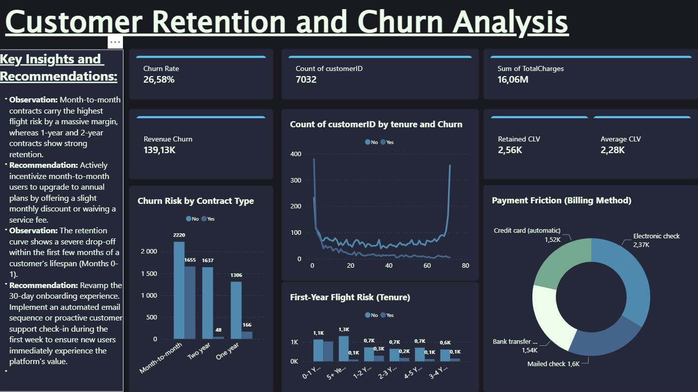

# 📊 Customer Retention & Churn Analysis (FUTURE_DS_02)

## 📌 Executive Summary
Analyzed a dataset of over 7,000 subscription customers to identify primary drivers of churn and model customer lifetime trends. The current organizational churn rate sits at **26.58%**, representing a significant leak in Monthly Recurring Revenue (MRR). This analysis identifies the root causes of customer drop-off and provides strategic interventions to improve retention.

## 📸 Dashboard Preview
 

## Live Link
https://app.powerbi.com/view?r=eyJrIjoiMzA2NDhkYTctNzVkMy00N2I1LWJmZjQtMTJkMTAwNmQxYTg1IiwidCI6IjRiMWI5MDhjLTU1ODItNDM3Ny1iYTA3LWEzNmQ2NWUzNDkzNCIsImMiOjh9

## 💡 Key Insights: The "Why" Behind the Churn
1. **The "Month-to-Month" Flight Risk:** Contract type is the single largest indicator of churn. Customers on month-to-month plans are churning at an exponentially higher rate than those locked into 1-year or 2-year contracts. There is no loyalty barrier preventing them from leaving.
2. **The First-Year Cliff (Lifetime Trend):** The tenure distribution chart reveals that the vast majority of churn happens within the first 12 months (specifically months 1-6). If a customer survives the first year, their likelihood of churning drops dramatically. 
3. **Payment Friction:** Customers utilizing manual payment methods (like mailed checks or manual electronic checks) churn significantly more than those on automated credit card billing or bank transfers. Manual payments force the user to actively think about the cost every single month.

## 🚀 Practical Recommendations (Action Plan)
If I were advising the product and growth teams, I would recommend the following immediate interventions:

* **Incentivize Annual Lock-ins:** Trigger an automated marketing campaign during a month-to-month user's 3rd month. Offer a one-time 15% discount to upgrade to an annual plan. Taking a small hit on the margin is worth securing the Lifetime Value (LTV) of a 1-year lock-in.
* **Revamp the Onboarding Experience:** Since the highest churn occurs in the first 6 months, the platform's "Time-to-Value" is too slow. Implement a proactive customer success touchpoint (e.g., a welcome call or premium onboarding email sequence) at Day 30 to ensure they are actually using the services they pay for.
* **Remove Payment Friction:** Push users toward Auto-Pay. Offer a small, permanent $5/month statement credit for users who switch from manual checks to automatic credit card billing. "Out of sight, out of mind" billing severely reduces voluntary churn.

## 🛠️ Tech Stack & Methodology
* **Data Preparation:** Python (Pandas) used to clean raw Telco data, handle null value anomalies, and engineer the `Tenure_Group` feature.
* **Data Modeling:** Power Query utilized for data type casting, error handling, and locale adjustments.
* **Visualization:** Power BI used to build an interactive, executive-facing dashboard utilizing custom DAX measures for KPI tracking.

## 📁 Repository Contents
* `cleaned_telco_churn.csv`: The processed dataset used for analysis.
* `clean_telco_data.py`: The Python script used for initial data wrangling.
* `FUTURE_DS_02.pbix`: The complete Power BI project file containing the data model and interactive dashboard layout.